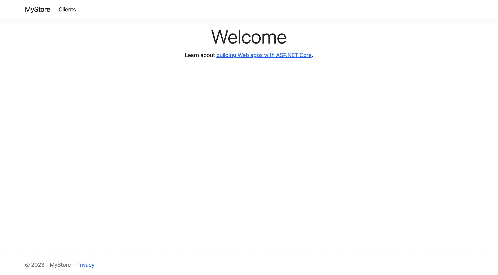

# First contact with .NET

Simplest asp.net core app for making table, with data from MySQL localhost Server.

## Connect to database

For connecting to your db server just change values below [in this file](https://github.com/Asthera/Simple-MySQL-ASP.NET/blob/main/MyStore/Pages/Clients/Client.cshtml.cs).

## How it work ?

- From starting app you are getting into main(default) page.

  > 

- Next you can click on **Clients** on navigation bar, you will redirected to page with empty table(if dont connect to db, or it empty).

  > 

- If you click **New Client** button, you will redirected to page where you must fill up form to add Client. After submitting you will return to page with table.

  > 

- Also you can **Edit** or **Delete** Clients through the corresponding buttons.
  > 
- For **Edit** button.
  > 

## Summary

By this project i understand:

- how to create asp.net app from template,
- how to use HTML/CSS/JS in it,
- how to connect database to it,
- how make manipulation with tables in db.
